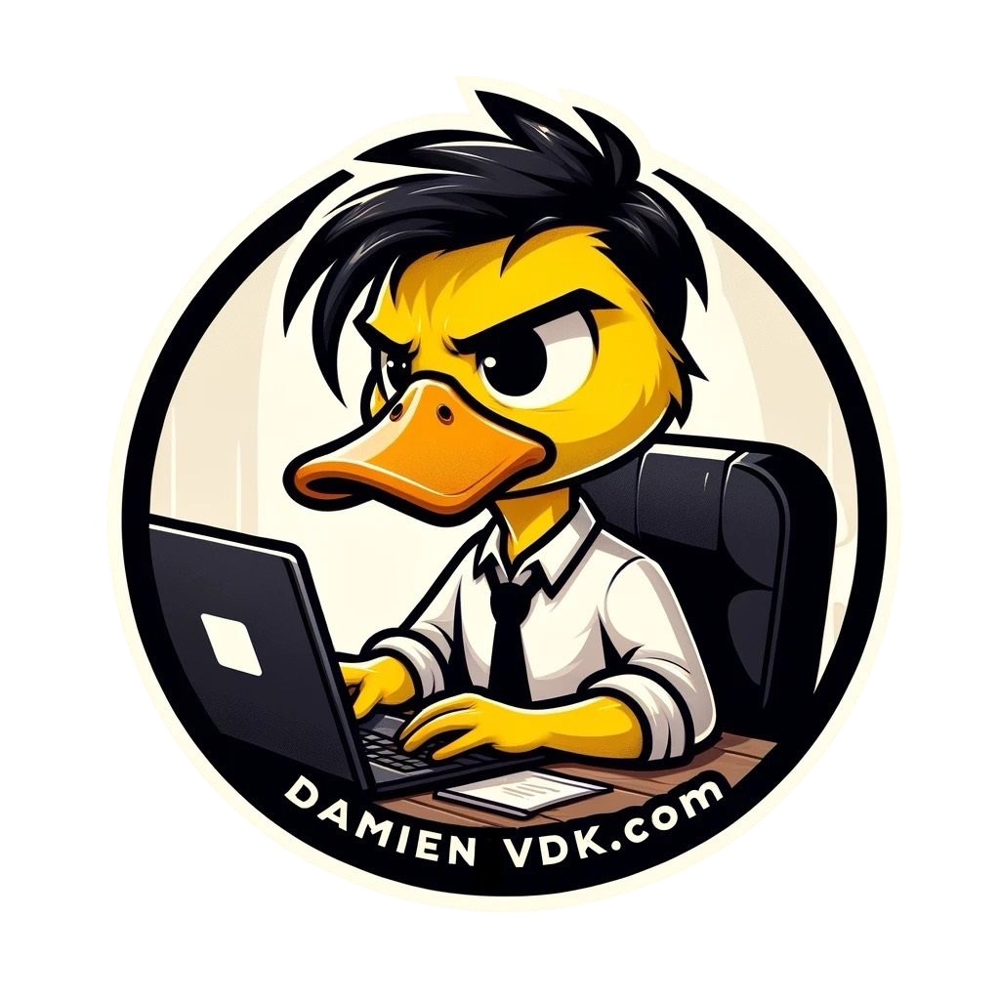

### Hi there! I'm Damien Vande Kerckhove aka DamienVDK

## I'm a :computer: .Net developer / :black_nib: Blogger / :mega: Speaker

  
  

I am an experienced professional in *software development and architecture*, boasting nearly 15 years of expertise, with a focus on *Microsoft technologies*. Regularly, I publish articles on *Medium.com*, contribute to podcasts on *DevDevDev.net*, and occasionally impart my knowledge at conferences and events dedicated to computer development.

[My blog](https://damienvdk.com)

Contributions in 2025
---

|📆 Date | 📎Type | 🌍 Language | 📄 Description | 🔗 Link |
| --- | --- | --- | --- | --- |
| 06-19-2025 | Video | FR | Découverte des agents AI - Microsoft Reactor | [Link to video](https://www.youtube.com/watch?v=6DYFeOQavyk&pp=ygUabWljcm9zb2Z0IHJlYWN0b3IgYWdlbnQgaWE%3D) |
| 06-17-2025 | Local Event | EN | Github Copilot Bootcamp @ Brussels | |
| 06-12-2025 | Video | FR | Interagir avec des modèles et des agents multimodaux dans Azure AI Foundry - Microsoft Reactor | [Link to video](https://www.youtube.com/watch?v=JMIpE3tdCvg&t=366s) |
| 05-14-2025 | Podcast | FR | Azure AI Agent - DevDevDev.net | [Link to podcast](https://devdevdev.net/tr05-25-docker-ai-ai-agents-nfs-vs-smb-et-workload-identity-federation/) |
| 04-11-2025 | Podcast | FR | XUnit V3 - DevDevDev.net | [Link to podcast](https://devdevdev.net/tr04-25-drama-autour-de-automapper-mediatr-xunit-v3-semantic-kernel/) |
| 03-31-2025 | Blog | EN | Securing Access to Blob Storage: Authentication and Best Practicess | [Link to article](https://medium.com/@damien.vandekerckhove/securing-access-to-blob-storage-authentication-and-best-practices-b9217add5b4a) |
| 03-30-2025 | Blog | EN | Writing clean code, a true form of art | [Link to article](https://medium.com/@damien.vandekerckhove/writing-clean-code-a-true-form-of-art-00d85260d734) |
| 02-17-2025 | Podcast | FR | Github Copilot - DevDevDev.Net | [Link to podcast](https://devdevdev.net/tr02-2025-fluent-assertions-github-copilot-les-50-ans-de-ms-peeble-os-et-le-go/) |
| 01-19-2025 | Blog | EN | Mastering the SOLID Principles in C#: A Practical Guide with Examples | [Link to article](https://medium.com/@damien.vandekerckhove/mastering-the-solid-principles-in-c-a-practical-guide-with-examples-2bbf478d6b3f) |
| 01-15-2025 | Podcast | FR | Azure Storage Account - DevDevDev.Net | [Link to podcast](https://devdevdev.net/tr01-2025-accessibilite-azure-storage-action-golden-master-et-agentic-ai/) |

Contributions in 2024
---

|📆 Date | 📎Type | 🌍 Language | 📄 Description | 🔗 Link |
| --- | --- | --- | --- | --- |
| 12-11-2024 | Local Event | EN | .Net Conf @ Brussels | |
| 05-28-2024 | Podcast | FR | Retour sur la Microsoft Build 2024 - DevDevDev.Net | [Link to podcast](https://devdevdev.net/retour-sur-la-microsoft-build-2024) | 
| 03-05-2024 | Podcast | FR | Chaos engineering avec Polly V8 | [Link to podcast](https://devdevdev.net/tr03-24-github-copilot-chaos-engeneering-llm-local/) | 
| 02-05-2024 | Podcast | FR | Azure App Configuration - DevDevDev.Net | [Link to podcast](https://devdevdev.net/tr01-24-benchmarkdotnet-monitoring-azure-deployment-stack-app-configuration-dev-drive-llm-en-local/) |
| 01-26-2024 | Magazine | FR | Programmez.com - Rédiger du code, une véritable forme d’art | [Link to article](https://www.programmez.com/magazine/article/rediger-du-code-une-veritable-forme-dart) |
| 01-22-2024 | Blog | EN | Why You Shouldn’t Call BuildServiceProvider in .NET Development | [Link to article](https://medium.com/@damien.vandekerckhove/why-you-shouldnt-call-buildserviceprovider-in-net-development-8e25f680d529) |

Contributions in 2023
---

|📆 Date | 📎Type | 🌍 Language | 📄 Description | 🔗 Link |
| --- | --- | --- | --- | --- |
| 12-19-2023 | Podcast | FR | Security in CI/CD - DevDevDev.Net | [Link to podcast](https://devdevdev.net/tr12-23-wasi-suivre-azure-ci-et-vulnerabilites-fluent-assertions-et-des-dindes-de-noel/) |
| 12-03-2023 | Blog | EN | C# 12 — Primary Constructor: What can it bring to you? | [Link to article](https://medium.com/@damien.vandekerckhove/c-12-primary-constructor-what-can-it-bring-to-you-7ac84e01bc7a) |
| 11-26-2023 | Blog | EN | C# — Checks for sufficient memory resources before executing an operation | [Link to article](https://medium.com/@damien.vandekerckhove/experienced-story-c-checks-for-sufficient-memory-resources-before-executing-an-operation-4a75e4bb00a0?sk=e9cd9162af3b4e83e5107227e10740bb) |
| 11-22-2023 | Podcast | FR | GitHub Universe - DevDevDev.Net | [Link to podcast](https://devdevdev.net/tr11-23-github-universe-litedb-pi5-aspire-et-programmez-260/) |
| 11-07-2023 | Talk | FR | Porgrammez.Com Paris - Sesion HttpClient + Nouveautés C# 12 | |
| 10-11-2023 | Podcast | FR | Fitness Function - DevDevDev.Net | [Link to podcase](https://devdevdev.net/tr10-23-avalonia-fitness-function-les-fichiers-sous-linux-az-deployment-stack-et-midi-2-0/) |
| 10-09-2023 | Blog | EN | How to ensure the architectural characteristics in an evolutionary architecture | [Link to article](https://medium.com/@damien.vandekerckhove/how-to-ensure-the-architectural-characteristics-in-an-evolutionary-architecture-02551d973e0a?sk=7460ffcf617063352a524a3faefdd211) |
| 09-19-2023 | Blog | EN | Create dynamic Linq queries with Predicate Builder | [Link to article](https://medium.com/@damien.vandekerckhove/create-dynamic-linq-queries-with-predicate-builder-c3f1eb062d96?sk=373e0b787499b71b2fbc8634b47ce65d) |
| 09-11-2023 | Podcast | FR | Scandale MoQ - DevDevDev.Net | [Link to podcast](https://devdevdev.net/tr09-23-le-scandale-moq-loutil-de-migration-de-ms-le-monitoring-sous-azure-et-programmez/) |
| 09-08-2023 | Blog | EN | Master dependency injection in C# .Net | [Link to article](https://medium.com/@damien.vandekerckhove/master-dependency-injection-in-c-net-a47d9f0af7ac?sk=9d0786e5f3c823adf2b2ed09b834f10c) |
| 07-24-2023 | Podcast | FR | Nuget Polly - DevDevDev.Net | [Link to podcast](https://devdevdev.net/les-nuget-de-lete-polly/) |
| 05-26-2023 | Blog | EN | C#: Generic interface : covariance, contravariance and invariance | [Link to article](https://medium.com/@damien.vandekerckhove/c-generic-interface-covariance-contravariance-and-invariance-5713b58d4af6?sk=a7567a26a1b1c41140b611761a8cc248) |
| 05-11-2023 | Talk | FR | Global Azure 2023 Strasbourg - Azure Container App | [Link to video](https://www.youtube.com/watch?v=_cU3fxggquM&t=10461s) |
| 04-19-2023 | Video | FR | Faut-il avoir peur de déployer son application en production? | [Link to video](https://www.youtube.com/watch?v=ZgocTN_a4T8) |
| 03-08-2023 | Video | FR | Chat GPT 3 | [Link to video](https://www.youtube.com/watch?v=odfZdyRAw48&t) |
| 02-20-2023 | Podcast | FR | Azure Container Apps - DevDevDev.Net | [Link to podcast](https://devdevdev.net/azure-container-apps/) |
